# 🦞 cline-subagents-skill

> An [OpenClaw](https://openclaw.ai) skill that lets your AI agent orchestrate [Cline CLI 2.0](https://cline.bot/cli) sub-agents for autonomous coding tasks.

[](LICENSE)
[](https://cline.bot/cli)
[](https://openclaw.ai)
[](reports/how-it-was-built.md)
[](reports/how-it-was-built.md)
[](CHANGELOG.md)

## Current Status (Feb 2026)

| Feature | Status | Notes |
|---------|--------|-------|
| Single agent (headless) | ✅ Working | `-y` mode, sandboxed |
| Parallel multi-agent (tmux) | ✅ Working | Stagger 2s between launches |
| Project isolation (CLINE_DIR) | ✅ Working | Must copy auth to each config |
| .clineignore support | ✅ Working | Essential for Node.js projects |
| Free model (kat-coder-pro) | ✅ Working | Routes to glm-5, $0 cost |
| Usage monitoring | ✅ Working | `scripts/cline-monitor.sh` |
| Cron/scheduled tasks | ✅ Working | `scripts/cline-cron.sh` |
| OpenClaw heartbeat integration | ✅ Working | Via HEARTBEAT.md |

### Field-Tested Results

Ran a **4-agent parallel security audit** on a production project (FastAPI + Next.js):

| Agent | Focus | Result | Lines | Time |
|-------|-------|--------|-------|------|
| Agent 1 | API Security | ✅ 25 findings (3 CRITICAL) | 807 | ~8 min |
| Agent 2 | Frontend Security | ✅ 1 HIGH, 2 LOW | 290 | ~6 min |
| Agent 3 | Dependency Audit | ✅ Critical CVEs found | 360 | ~5 min |
| Agent 4 | Infrastructure | ✅ 12 findings (3 HIGH) | 478 | ~7 min |

**Total cost: $0.00** (free model via Cline OAuth)

**👉 [QUICKSTART.md](QUICKSTART.md) — Get running in 5 minutes**

## What is this?

This skill teaches an OpenClaw bot to delegate coding tasks to **Cline CLI 2.0** sub-agents running in headless mode. Each sub-agent is sandboxed to a specific project directory with scoped permissions.

**Key capabilities:**
- 🔧 Bug fixing, refactoring, and feature development
- 🧪 Test execution with automatic failure repair
- 📝 Code review via piped git diffs
- 📦 Dependency audits and security scanning
- 🔀 Git workflow management (branching, commits)
- ⚡ Parallel multi-agent execution via tmux
- 🔒 Project-scoped sandboxing with command allow/deny lists
- 📊 Usage monitoring and cost tracking
- ⏰ Scheduled/cron task execution

## Architecture

```mermaid
graph TD
    A["👨‍💻 Human<br/>Chat Interface"] -->|"Task request"| B
    B["🌐 OpenClaw<br/>Agent Platform"] -->|"Routes to agent"| C
    C["🧠 Orchestrator<br/>Claude / GPT / etc"] -->|"Delegates via tmux"| D
    C -->|"Delegates"| E
    C -->|"Delegates"| F
    D["⚡ Cline Agent 1<br/>Project A"]
    E["⚡ Cline Agent 2<br/>Project B"]
    F["⚡ Cline Agent N<br/>Project N"]
    D --> G["📊 Results"]
    E --> G
    F --> G
    G -->|"Summary"| A

    style C fill:#f9f,stroke:#333
    style D fill:#bbf,stroke:#333
    style E fill:#bbf,stroke:#333
    style F fill:#bbf,stroke:#333
```



Each Cline sub-agent:
- Runs in headless mode (`-y` / YOLO) with isolated `CLINE_DIR`
- Has scoped `CLINE_COMMAND_PERMISSIONS` (allow/deny lists)
- Uses `.clineignore` to skip large directories
- Auth credentials copied from `~/.cline/`

## Installation

### Prerequisites

- **Node.js 20+** (22 recommended)
- **npm**
- **git**
- **tmux** (for parallel agents)
- **Python 3** (for monitoring script)
- **Cline CLI 2.0**: `npm install -g cline`

### Quick Install

```bash
git clone https://github.com/ericmil87/cline-cli-2-orchestration-openclaw-skill.git
cd cline-cli-2-orchestration-openclaw-skill
bash install.sh
```

### Manual Install

```bash
# 1. Install Cline CLI
npm install -g cline

# 2. Authenticate
cline auth

# 3. Copy skill to OpenClaw skills directory
mkdir -p ~/clawd/skills/cline-subagents/scripts
cp SKILL.md ~/clawd/skills/cline-subagents/
cp scripts/*.sh ~/clawd/skills/cline-subagents/scripts/
chmod +x ~/clawd/skills/cline-subagents/scripts/*.sh

# 4. Copy auth to isolated configs
for dir in default project-a project-b project-c; do
  mkdir -p ~/.cline-configs/$dir
  cp -r ~/.cline/* ~/.cline-configs/$dir/ 2>/dev/null || true
done

# 5. Restart OpenClaw
openclaw gateway restart
```

## ⚠️ Critical Setup Notes (Lessons Learned)

### 1. Always create `.clineignore`

Agents **will hang** scanning `node_modules/`. Create this at every project root:

```bash
cat > /your/project/.clineignore << 'EOF'
node_modules/
.next/
dist/
build/
venv/
__pycache__/
*.log
.git/
EOF
```

### 2. Copy auth to isolated CLINE_DIRs

Isolated configs don't inherit auth from `~/.cline/`:

```bash
cp -r ~/.cline/* ~/.cline-configs/my-project/ 2>/dev/null || true
```

### 3. Scope frontend scans explicitly

Large frontend projects timeout. Always specify exact dirs:

```
"Scan web/app/, web/components/, web/lib/ — SKIP node_modules"
```

### 4. Stagger parallel launches

Add 2s delay between tmux agent launches to avoid rate limits.

## Authentication

### Method A: SSH Tunnel (enables free models)

```bash
# From your LOCAL machine:
ssh -L 48801:localhost:48801 -L 48802:localhost:48802 user@server

# On the server:
cline auth
# → Choose "Sign in with Cline" → Copy URL → Paste in local browser
```

### Method B: Auth Locally, Copy Credentials

```bash
# Local machine:
npm install -g cline && cline auth
scp -r ~/.cline/data/ user@server:~/.cline/data/
```

### Method C: API Key (no browser)

```bash
cline auth -p openrouter -k sk-or-v1-YOUR_KEY
cline auth -p anthropic -k sk-ant-YOUR_KEY -m claude-sonnet-4-5-20250929
```

## Scripts

| Script | Purpose |
|--------|---------|
| `scripts/cline-monitor.sh` | Usage tracking, token/cost monitoring, threshold alerts |
| `scripts/cline-cron.sh` | Scheduled multi-agent task runner (config-driven) |
| `cline-project.sh` | Single-project agent wrapper with safety defaults |
| `cline-multi.sh` | Interactive parallel agent orchestrator via tmux |

### Usage Monitoring

```bash
# Full report
bash scripts/cline-monitor.sh

# JSON output only (for scripting)
bash scripts/cline-monitor.sh --json

# Quiet mode (only output on warnings)
bash scripts/cline-monitor.sh --quiet

# Custom thresholds via env vars
CLINE_DAILY_TASK_WARN=100 CLINE_DAILY_TOKEN_WARN=1000000 bash scripts/cline-monitor.sh
```

### Scheduled Tasks (Cron)

Create a config file and run with `cline-cron.sh`:

```conf
# my-tasks.conf
name: code-review
project: /home/ubuntu/my-app
task: Review recent git changes for bugs and security issues
timeout: 300
output: /tmp/results/review.md
parallel: true
---
name: test-check
project: /home/ubuntu/my-app
task: Run tests and report any failures
timeout: 300
output: /tmp/results/tests.md
parallel: true
```

```bash
bash scripts/cline-cron.sh my-tasks.conf
```

#### OpenClaw Cron Integration (every 2.5h)

```bash
# Add to OpenClaw cron (runs every 2.5h)
openclaw cron add --every 150m --command "bash ~/clawd/skills/cline-subagents/scripts/cline-cron.sh ~/clawd/skills/cline-subagents/examples/periodic-review.conf"
```

Or via HEARTBEAT.md:
```markdown
### Cline Periodic Review
- Every 2.5h, run: `bash ~/clawd/skills/cline-subagents/scripts/cline-cron.sh ~/clawd/skills/cline-subagents/examples/periodic-review.conf`
- Check results in /tmp/cline-results/
- If critical issues found, notify Eric
```

## Free Models (Feb 2026)

| Model | Provider | Free? | Best For | Notes |
|-------|----------|-------|----------|-------|
| **kwaipilot/kat-coder-pro** | Cline (OAuth) | ✅ Yes | General coding | Routes to glm-5, tested & working |
| Kimi K2.5 | Cline (OAuth) | ✅ Promo | Complex reasoning | May expire |
| MiniMax M2.5 | Cline (OAuth) | ✅ Promo | Multi-agent, fast | 100 tok/s |
| Arcee Trinity Large | Cline (OAuth) | ✅ Yes | General | Fallback option |
| DeepSeek V3 | OpenRouter | ✅ Free tier | Refactoring | |
| Qwen 3 | OpenRouter | ✅ Free tier | Multilingual | |

### Cline Pricing

| Plan | Cost | Notes |
|------|------|-------|
| **Open Source** | $0 forever | Full CLI + multi-agent. **This is what we use.** |
| Teams | $20/user/mo | Free through Q1 2026. First 10 seats always free. |
| Enterprise | Custom | SSO, SLA, VPC |

AI inference is always BYOK (bring your own key) or use free models. Cline doesn't charge for AI usage.

## Configuration

### Command Permissions

```json
{
  "allow": ["npm *", "git *", "node *", "cat *", "ls *", "grep *", "find *"],
  "deny": ["rm -rf /", "sudo *", "git push *", "curl * | bash"],
  "allowRedirects": true
}
```

### Security Model

| Action | Default | Override |
|--------|---------|----------|
| Read files in project | ✅ Allowed | — |
| Edit files in project | ✅ Allowed | — |
| Run npm/node/git | ✅ Allowed | Configurable |
| Delete files | ⚠️ Restricted | User approval |
| Push to remote | 🚫 Denied | User approval |
| System commands (sudo) | 🚫 Denied | Never |

## Project Structure

```
cline-cli-2-orchestration-openclaw-skill/
├── SKILL.md                     # Runtime skill for OpenClaw
├── README.md                    # This file
├── LICENSE                      # MIT
├── install.sh                   # Automated installer
├── cline-project.sh             # Single-project agent wrapper
├── cline-multi.sh               # Interactive multi-agent orchestrator
├── .clineignore                 # Template ignore file
├── scripts/
│   ├── cline-monitor.sh         # Usage monitoring & alerts
│   └── cline-cron.sh            # Scheduled task runner
└── examples/
    ├── security-audit.conf      # 4-agent security audit config
    └── periodic-review.conf     # 2.5h periodic review config
```

## Roadmap

### ✅ Done
- [x] SKILL.md with field-tested instructions
- [x] Parallel multi-agent via tmux
- [x] Project isolation with CLINE_DIR
- [x] .clineignore support
- [x] Usage monitoring script
- [x] Cron/scheduled task runner
- [x] Example configs (security audit, periodic review)
- [x] Free model configuration (kat-coder-pro)

### 🔜 Next Steps
- [ ] Auto-detect project type and adjust .clineignore accordingly
- [ ] Result aggregation script (merge agent reports into executive summary)
- [ ] Slack/Telegram notification on task completion
- [ ] Token budget per agent (kill if exceeding limit)
- [ ] Agent retry logic with fallback models
- [ ] CI/CD integration examples (GitHub Actions, GitLab CI)
- [ ] Docker compose for containerized agents
- [ ] Web dashboard for monitoring agent runs
- [ ] Support for `.clinerules` per-project behavior config
- [ ] OpenClaw cron native integration (auto-register tasks)

## Contributing

Contributions welcome! Please open an issue or PR.

**Priority areas:**
- CI/CD pipeline examples
- Token budget enforcement
- Better retry/fallback logic
- Windows/macOS testing

## License

MIT — see [LICENSE](LICENSE) for details.

## Authors

- **Eric Milfont** — [@ericmil87](https://github.com/ericmil87)
- **Cláudio Milfont** — [@claudiomil87](https://github.com/claudiomil87) (AI collaborator)

---

*Built for the [OpenClaw](https://openclaw.ai) ecosystem. Powered by [Cline CLI 2.0](https://cline.bot/cli).*
